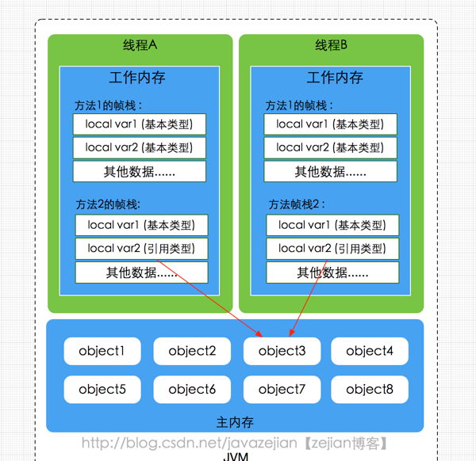

## 硬件内存架构

在CPU内部有一组CPU寄存器，寄存器是cpu直接访问和处理的数据，是一个临时放数据的空间。一般CPU都会从内存取数据到寄存器，然后进行处理，但由于内存的处理速度远远低于CPU，导致CPU在处理指令时往往花费很多时间在等待内存做准备工作，于是在寄存器和主内存间添加了CPU缓存，CPU缓存比较小，但访问速度比主内存快得多，如果CPU总是操作主内存中的同一址地的数据，很容易影响CPU执行速度，此时CPU缓存就可以把从内存提取的数据暂时保存起来，如果寄存器要取内存中同一位置的数据，直接从缓存中提取，无需直接从主内存取。需要注意的是，寄存器并不每次数据都可以从缓存中取得数据，万一不是同一个内存地址中的数据，那寄存器还必须直接绕过缓存从内存中取数据。所以并不每次都得到缓存中取数据，这种现象有个专业的名称叫做缓存的命中率，从缓存中取就命中，不从缓存中取从内存中取，就没命中，可见缓存命中率的高低也会影响CPU执行性能，这就是CPU、缓存以及主内存间的简要交互过程，总而言之当一个CPU需要访问主存时，会先读取一部分主存数据到CPU缓存(当然如果CPU缓存中存在需要的数据就会直接从缓存获取)，进而在读取CPU缓存到寄存器，当CPU需要写数据到主存时，同样会先刷新寄存器中的数据到CPU缓存，然后再把数据刷新到主内存中


<!--more-->

## Java多线程模型
由于CPU和内存之间的这种关系，对应的Java在多线程情况下的内存模型也极为相似。Java内存模型(即Java Memory Model，简称JMM)本身是一种抽象的概念，并不真实存在，它描述的是一组规则或规范，通过这组规范定义了程序中各个变量（包括实例字段，静态字段和构成数组对象的元素）的访问方式。由于JVM运行程序的实体是线程，而每个线程创建时JVM都会为其创建一个工作内存(有些地方称为栈空间)，用于存储线程私有的数据，而Java内存模型中规定所有变量都存储在主内存，主内存是共享内存区域，所有线程都可以访问，但线程对变量的操作(读取赋值等)必须在工作内存中进行，首先要将变量从主内存拷贝的自己的工作内存空间，然后对变量进行操作，操作完成后再将变量写回主内存，不能直接操作主内存中的变量，工作内存中存储着主内存中的变量副本拷贝，前面说过，工作内存是每个线程的私有数据区域，因此不同的线程间无法访问对方的工作内存，线程间的通信(传值)必须通过主内存来完成，其简要访问过程如下图

 
 
 需要注意的是，JMM与Java内存区域的划分是不同的概念层次，更恰当说JMM描述的是一组规则，通过这组规则控制程序中各个变量在共享数据区域和私有数据区域的访问方式，JMM是围绕原子性，有序性、可见性展开的(稍后会分析)。JMM与Java内存区域唯一相似点，都存在共享数据区域和私有数据区域，在JMM中主内存属于共享数据区域，从某个程度上讲应该包括了堆和方法区，而工作内存数据线程私有数据区域，从某个程度上讲则应该包括程序计数器、虚拟机栈以及本地方法栈。或许在某些地方，我们可能会看见主内存被描述为堆内存，工作内存被称为线程栈，实际上他们表达的都是同一个含义。关于JMM中的主内存和工作内存说明如下

### 主内存

主要存储的是Java实例对象，所有线程创建的实例对象都存放在主内存中，不管该实例对象是成员变量还是方法中的本地变量(也称局部变量)，当然也包括了共享的类信息、常量、静态变量。由于是共享数据区域，多条线程对同一个变量进行访问可能会发现线程安全问题。

### 工作内存

主要存储当前方法的所有本地变量信息(工作内存中存储着主内存中的变量副本拷贝)，每个线程只能访问自己的工作内存，即线程中的本地变量对其它线程是不可见的，就算是两个线程执行的是同一段代码，它们也会各自在自己的工作内存中创建属于当前线程的本地变量，当然也包括了字节码行号指示器、相关Native方法的信息。注意由于工作内存是每个线程的私有数据，线程间无法相互访问工作内存，因此存储在工作内存的数据不存在线程安全问题。

弄清楚主内存和工作内存后，接了解一下主内存与工作内存的数据存储类型以及操作方式，根据虚拟机规范，对于一个实例对象中的成员方法而言，如果方法中包含本地变量是基本数据类型（boolean,byte,short,char,int,long,float,double），将直接存储在工作内存的帧栈结构中，但倘若本地变量是引用类型，那么该变量的引用会存储在功能内存的帧栈中，而对象实例将存储在主内存(共享数据区域，堆)中。但对于实例对象的成员变量，不管它是基本数据类型或者包装类型(Integer、Double等)还是引用类型，都会被存储到堆区。至于static变量以及类本身相关信息将会存储在主内存中。需要注意的是，在主内存中的实例对象可以被多线程共享，倘若两个线程同时调用了同一个对象的同一个方法，那么两条线程会将要操作的数据拷贝一份到自己的工作内存中，执行完成操作后才刷新到主内存，简单示意图如下所示：

 
 
## volatile保证可见性
### 线程隐试通信
已知```int a = 2``` ，在程序中有线程A、线程B对a进行了操作， 线程A执行a++; 这时B读取到的可能是几.

1. 初始状态

线程 | 寄存器 | 工作内存 | 共享内存
:-: | :-: | :-: | :-: 
线程A| | a=2| a=2
线程B| | a=2| a=2

2. 线程A读取数据到寄存器进行+1操作

线程 | 寄存器 | 工作内存 | 共享内存
:-: | :-: | :-: | :-: 
线程A| a=2+1=3 | a=2| a=2
线程B| | a=2| a=2

3. 线程A回写数据到工作内存到共享内存

线程 | 寄存器 | 工作内存 | 共享内存
:-: | :-: | :-: | :-: 
线程A| | a=3| a=3
线程B| | a=2| a=3

4. 线程B刷新工作内存中数据

线程 | 寄存器 | 工作内存 | 共享内存
:-: | :-: | :-: | :-: 
线程A| | a=3| a=3
线程B| | a=3| a=3

这时会出现一个问题，第四部执行的时间是无法控制的，在线程A对a进行操作后并不能立即使线程B拿到更新后的值，这时就可以在声明变量a的时候使用`volatile`关键字。
### 解决方案
当写一个`volatile`变量时，JMM会把该线程对应的工作内存中的共享变量值刷新到主内存中，同时将其他线程工作内存的该变量置为无效，当读取`volatile`变量时，只能从主内存中重新读取共享变量。`volatile`变量正是通过这种写-读方式实现对其他线程可见

## volatile禁止指令重排
### 指令重排的定义
计算机在执行程序时，为了提高性能，编译器和处理器的常常会对指令做重排，一般分以下3种

1. 编译器优化的重排

编译器在不改变单线程程序语义的前提下，可以重新安排语句的执行顺序。

2. 指令并行的重排

现代处理器采用了指令级并行技术来将多条指令重叠执行。如果不存在数据依赖性(即后一个执行的语句无需依赖前面执行的语句的结果)，处理器可以改变语句对应的机器指令的执行顺序

3. 内存系统的重排

由于处理器使用缓存和读写缓存冲区，这使得加载(load)和存储(store)操作看上去可能是在乱序执行，因为三级缓存的存在，导致内存与缓存的数据同步存在时间差。

### 单线程/多线程下指令重排
```
int a = 3;
int b = 4;
int c = a+b
int d = a+1;
```
JVM在对上方代码进行编译时会在不改变单线程程序语义的前提下对上方代码进行重新排序
指令重排理解起来并不复杂，不过感觉没必要从深层次去探究。这里简单介绍下，有下方代码
```
可能1：
int b = 4;
int a = 3;
int c = a+b
int d = a+1;
可能2：
int a = 3;
int d = a+1;
int b = 4;
int c = a+b
可能3：
int b = 4;
int a = 3;
int d = a+1;
int c = a+b
```
**重排后在单线程中会提高程序的执行速度，但对于多线程环境而已，指令重排就可能导致严重的程序轮序执行问题，如下**

```
class MixedOrder{
    int a = 0;
    boolean flag = false;
    public void writer(){
        a = 1;
        flag = true;
    }

    public void read(){
        if(flag){
            int i = a + 1；
        }
    }
}
```
如上述代码，同时存在线程A和线程B对该实例对象进行操作，其中A线程调用写入方法，而B线程调用读取方法，由于指令重排等原因，可能导致程序执行顺序变为如下：

```
 线程A                    线程B
 writer：                 read：
 1:flag = true;           1:flag = true;
 2:a = 1;                 2: a = 0 ; //误读
 3:i = 2;                 3: i = 1 ;
```
由于指令重排的原因，线程A的flag置为true被提前执行了，而a赋值为1的程序还未执行完，此时线程B，恰好读取flag的值为true，直接获取a的值（此时B线程并不知道a为0）并执行i赋值操作，结果i的值为1，而不是预期的2，这就是多线程环境下，指令重排导致的程序乱序执行的结果。因此，请记住，指令重排只会保证单线程中串行语义的执行的一致性，但并不会关心多线程间的语义一致性。

## JVM的happens-before原则


倘若在程序开发中，仅靠sychronized和volatile关键字来保证原子性、可见性以及有序性，那么编写并发程序可能会显得十分麻烦，幸运的是，在Java内存模型中，还提供了happens-before 原则来辅助保证程序执行的原子性、可见性以及有序性的问题，它是判断数据是否存在竞争、线程是否安全的依据，happens-before 原则内容如下

- 程序顺序原则，即在一个线程内必须保证语义串行性，也就是说按照代码顺序执行。

- 锁规则 解锁(unlock)操作必然发生在后续的同一个锁的加锁(lock)之前，也就是说，如果对于一个锁解锁后，再加锁，那么加锁的动作必须在解锁动作之后(同一个锁)。

- volatile规则 volatile变量的写，先发生于读，这保证了volatile变量的可见性，简单的理解就是，volatile变量在每次被线程访问时，都强迫从主内存中读该变量的值，而当该变量发生变化时，又会强迫将最新的值刷新到主内存，任何时刻，不同的线程总是能够看到该变量的最新值。

- 线程启动规则 线程的start()方法先于它的每一个动作，即如果线程A在执行线程B的start方法之前修改了共享变量的值，那么当线程B执行start方法时，线程A对共享变量的修改对线程B可见

- 传递性 A先于B ，B先于C 那么A必然先于C

- 线程终止规则 线程的所有操作先于线程的终结，Thread.join()方法的作用是等待当前执行的线程终止。假设在线程B终止之前，修改了共享变量，线程A从线程B的join方法成功返回后，线程B对共享变量的修改将对线程A可见。

- 线程中断规则 对线程 interrupt()方法的调用先行发生于被中断线程的代码检测到中断事件的发生，可以通过Thread.interrupted()方法检测线程是否中断。

- 对象终结规则 对象的构造函数执行，结束先于finalize()方法

上述8条原则无需手动添加任何同步手段(synchronized|volatile)即可达到效果，下面我们结合前面的案例演示这8条原则如何判断线程是否安全，如下：

```
class MixedOrder{
    int a = 0;
    boolean flag = false;
    public void writer(){
        a = 1;
        flag = true;
    }

    public void read(){
        if(flag){
            int i = a + 1；
        }
    }

```
同样的道理，存在两条线程A和B，线程A调用实例对象的writer()方法，而线程B调用实例对象的read()方法，线程A先启动而线程B后启动，那么线程B读取到的i值是多少呢？现在依据8条原则，由于存在两条线程同时调用，因此程序次序原则不合适。writer()方法和read()方法都没有使用同步手段，锁规则也不合适。没有使用volatile关键字，volatile变量原则不适应。线程启动规则、线程终止规则、线程中断规则、对象终结规则、传递性和本次测试案例也不合适。线程A和线程B的启动时间虽然有先后，但线程B执行结果却是不确定，也是说上述代码没有适合8条原则中的任意一条，也没有使用任何同步手段，所以上述的操作是线程不安全的，因此线程B读取的值自然也是不确定的。修复这个问题的方式很简单，要么给writer()方法和read()方法添加同步手段，如synchronized或者给变量flag添加volatile关键字，确保线程A修改的值对线程B总是可见。

> 参考: [全面理解Java内存模型(JMM)及volatile关键字](https://blog.csdn.net/javazejian/article/details/72772461)
