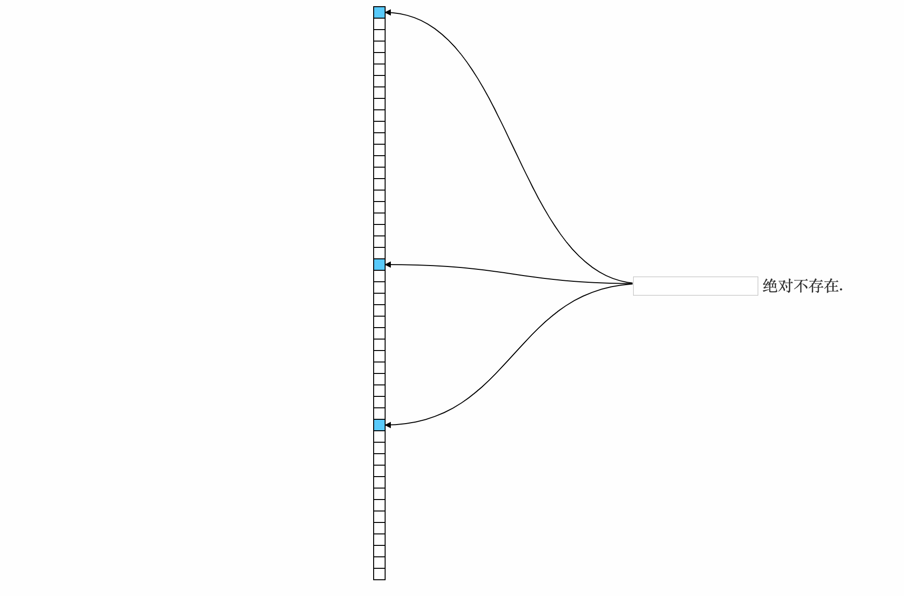
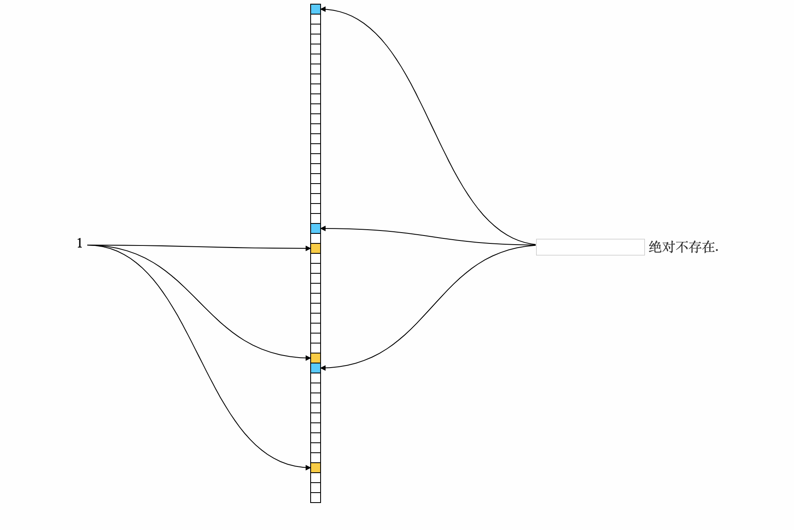
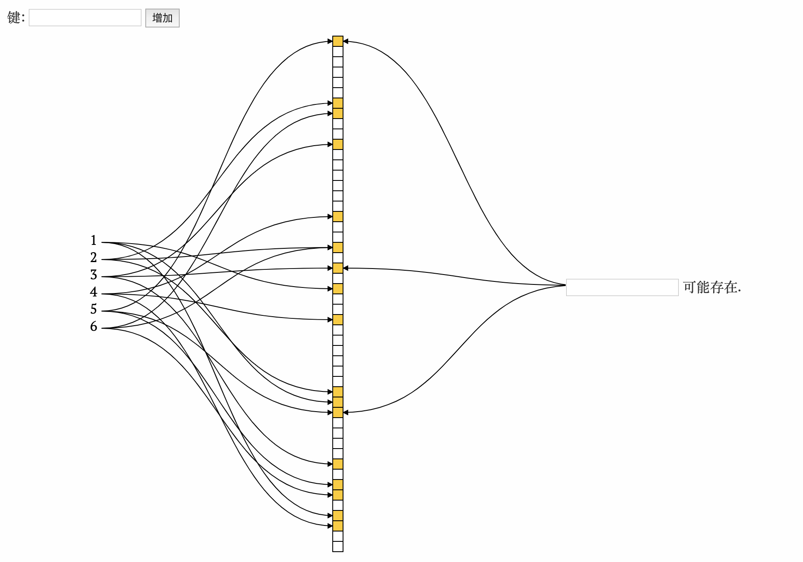
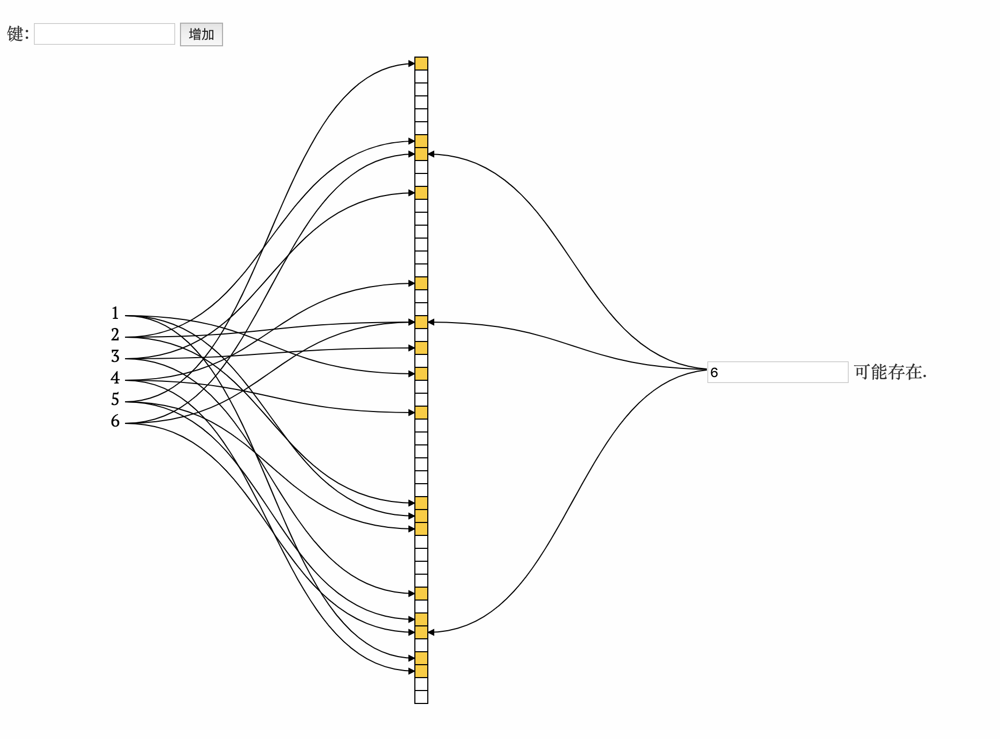

# 前言
> 布隆过滤器（Bloom Filter）是1970年由布隆提出的。它实际上是一个很长的二进制向量和一系列随机映射函数。布隆过滤器可以用于检索一个元素是否在一个集合中。它的优点是空间效率和查询时间都比一般的算法要好的多，缺点是有一定的误识别率和删除困难。(来源:百度百科)

## 是什么
可以理解为一个很长的数组, 将大批量的数据初始化进这个数组后, 我们可以判断一个数据在这一大批数据中是否存在. 
如果判断结果为存在, 那么有可能存在, 也有可能不存在; 如果判断结果为不存在, 那么它肯定不存在

<!--more-->

## 有什么用
1. 解决redis缓存穿透问题
    1. 先将数据初始化进过滤器
    2. 请求来了先用过滤器判断有没有
        - 没有 -> 直接返回
        - 有 -> 下一步
    3. 查询redis
        - 没有 -> 查询数据库
            - 数据库有 -> 加入redis并返回
            - 数据库没有 -> 加入redis一个n秒以内的随机时间的空对象并返回
        - 有 -> 直接返回
2. 网页url去重
3.  垃圾邮件

# 原理
> 图片中黄色代表1, 白色代表0
1. 首先创建如下一个全为0的固定长度的数组

2. 向数组中插入1条数据, 插入时先对数据进行计算得到n个下标位置, 然后将这些位置的值修改为1. 如图所示标黄的位置为计算出1所在的下标

3. 将数据全部初始化入数组, 如果计算出的下标位置已经为1, 那么保持1不变

4. 进行查询:
    - **查询3`存在`, 计算得出的n个下标位置全为1, 则3可能存在**

    - **查询7`不存在`, 计算得出的n个下标位置全为1, 则7可能存在**

    - **查询9`不存在`, 计算得出的n个下标位置中有一个为0, 则9绝对不存在**

 
# 思考
1. 影响布隆过滤器查询到不存在数据却反回可能存在的节点在哪些地方呢?
    - 数组的长度(长度越长误差越小)
    - 计算下标的hash算法
2. 从原理上我们可以分析出布隆过滤器是不支持删除的, 所以我们需要定期的初始化一个新的布隆过滤器来替换之前的

> 上图工具很直观. 需要请自取
> 链接:https://pan.baidu.com/s/1C3n4cmdUJPolqJ0v0uDifQ  密码:1tzq