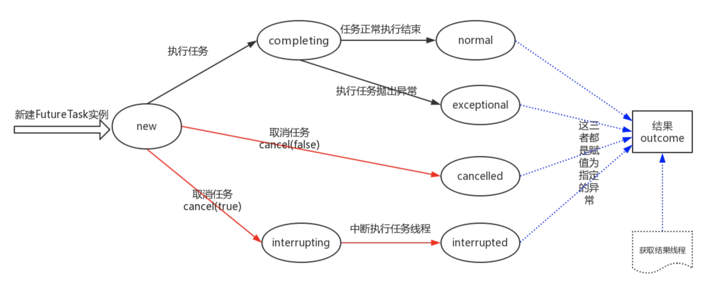

转载自[《线程池系列一》-FutureTask原理讲解与源码剖析](https://www.jianshu.com/p/36f8f3b8ee55)

> FutureTask对象可以接收其他线程的执行结果，将同步操作改为异步操作，从而提高服务的响应时间和吞吐量。那么FutureTask底层使用了LockSupport实现线程间的通信，那么FutureTask是如何获取其他线程的执行结果，又是如何取消任务的执行。本节将通过其源码进行原理的剖析 

# FutureTask的使用 

1. 配合线程池使用  
   用于接收线程池提交执行任务的返回值，并通过get方法获取任务的执行结果。
<!--more-->

```java
//创建固定大小的线程池
ThreadPoolExecutor executor = new ThreadPoolExecutor(10, 10, 0, 
    TimeUnit.SECONDS, new LinkedBlockingQueue<Runnable>(100));
//获取执行任务的结果，Task是实现callable的类
Future<Integer> future = executor.submit(new Task());
//此处可以处理其他的业务逻辑
//获取任务的执行结果
future.get();
```
作为线程的执行对象  
由于FutureTask实现了Runnable接口，因此FtureTask可以作为Thread对象的参数，执行任务

```java
//创建FutureTask实例
FutureTask futureTask = new FutureTask(new Task());
//执行FutureTask
new Thread(futureTask).start();
```

# FutureTask任务的状态 

FutureTask存在7种状态，其状态转换如下图所示 

其中：图中的实线的颜色不同代表不同的线程，任务的执行和任务的取消不是同一个线程，FutureTask任务有四种结束状态normal、exceptional、cancelled、interrupted。当执行get()方法获取结果时，如果不为这四种状态，操作会被阻塞，如果是这四种状态，则根据状态不同返回不同的结果。 

  1. new： 新建一个FutureTask实例时的状态
  2. completing： 该任务（FutureTask对象被执行，调用run()方法）被执行，run()方法执行完之后的状态
  3. normal： run()方法，正常执行完
  4. exceptional： run()方法，抛出异常
  5. cancelled： 调用任务的cancel(false)方法
  6. interrupting： 调用任务的cancel(true)方法的中间状态，后续讲解与interruputed的不同
  7. interrupted： 调用cacel(true)方法时，中断执行任务的线程

每一个状态对于一个int值，源码如下： 
    
```java
private static final int NEW          = 0;
private static final int COMPLETING   = 1;
private static final int NORMAL       = 2;
private static final int EXCEPTIONAL  = 3;
private static final int CANCELLED    = 4;
private static final int INTERRUPTING = 5;
private static final int INTERRUPTED  = 6;
```


2、3、4、6为终止状态 

# FutureTask的成员变量 

  * callable  
run()方法中执行的任务是指执行的是该对象的call()方法，因为FutureTask主要就是用来接收任务的执行结果的，所以在构建FutureTask实例时，需要传入callable对象
  * outcome  
存放任务执行结果的，类型为Object类型，可以是正常的结果，也可以是抛出的异常，任务执行完成后赋值
  * runner  
任务的执行线程，执行run()方法时赋值，只会有一个线程成为runner
  * waiters  
调用get()方法阻塞的线程会被构造为一个节点，加入到链表waiters中，waiters是链表的头结点（并不是执行get()方法的线程都会被加入到该链表中，下面会具体讲解）

节点定义如下： 
    
```java
static final class WaitNode {
    volatile Thread thread;
    volatile WaitNode next;
    WaitNode() { thread = Thread.currentThread(); }
}
```


存储了线程和下一个节点信息，存储线程主要是为了知道唤醒哪一个线程 

从FutureTask的成员变量中可以看出，当实例化一个FutureTask对象时，必须传入一个callable对象，即便传入的是runnable对象，最终也会转变为callable对象 

# FutureTask构造函数 

上面已经提及实例化FutureTask对象，必须传入callable对象，当然也可以传入runnable对象 
    
```java
public FutureTask(Callable<V> callable) {
    if (callable == null)
        throw new NullPointerException();
    this.callable = callable;
    this.state = NEW;       // ensure visibility of callable
}

//这种用的较少
public FutureTask(Runnable runnable, V result) {
    this.callable = Executors.callable(runnable, result);
    this.state = NEW;       // ensure visibility of callable
}
```


从构造函数中可以看出，构造函数只是做了两件事情，添加任务和初始化状态 

# FutureTask的任务执行run() 

线程池在调用submit()方法时，会将任务封装为一个FutureTask对象，而这个对象就是返回值，拿上面提到的代码举例： 
```
//创建固定大小的线程池
ThreadPoolExecutor executor = new ThreadPoolExecutor(10, 10, 0, 
    TimeUnit.SECONDS, new LinkedBlockingQueue<Runnable>(100));
//获取执行任务的结果，Task是实现callable的类
Future<Integer> future = executor.submit(new Task());
//此处可以处理其他的业务逻辑
//获取任务的执行结果
future.get();
```


其中， executor.submit(new Task())执行的操作相当于，new FutureTask(new Task());然后将该对象返回赋值给future，这样通过FutureTask同时维护了任务和结果两个属性。 

我们先来看一下run()方法的主体逻辑，源代码如下 
    
```java
public void run() {
    //1. 执行任务前的状态检查与设置runner线程
    if (state != NEW ||
        !UNSAFE.compareAndSwapObject(this, runnerOffset,
                                     null, Thread.currentThread()))
        return;
    try {
        //2. 执行任务
        Callable<V> c = callable;
        if (c != null && state == NEW) {
            V result;
            boolean ran;
            try {
                result = c.call();
                ran = true;
            } catch (Throwable ex) {
                result = null;
                ran = false;
                //3.异常结果
                setException(ex);
            }
            if (ran)
                //3. 正常执行结果
                set(result);
        }
    } finally {
        runner = null;
        int s = state;
        //5. 处理INTERRUPTING状态，就是等待一下
        if (s >= INTERRUPTING)
            handlePossibleCancellationInterrupt(s);
    }
}    
```


正如代码中注释一样，run()主要做了5件事，run()方法中主要涉及任务状态转化图中的黑色实线内容，下面我们一点点来剖析这5部分： 

（1）运行任务前的状态检查 

  * 任务状态必须为new  
如果不为new，说明任务已经运行，直接返回
  * 如果任务状态为new，使用CAS操作设置该任务的执行线程给runner（CAS操作为原子操作）  
如果设置不成功，说明runner的值不为null，也就是说其他线程已经在执行该任务  
如果设置成功，则进行后续操作

（2）执行任务 

  * 再次验证任务状态  
因为其他线程，在步骤1、2之间可能会取消该任务，所以再次判断
  * 执行任务  
调用callable的call()方法

（3）结果处理 

  * 正常结果处理  
其源代码如下：
    
```java
protected void set(V v) {
    if (UNSAFE.compareAndSwapInt(this, stateOffset, NEW, COMPLETING)) {
        outcome = v;
        UNSAFE.putOrderedInt(this, stateOffset, NORMAL); // final state
        finishCompletion();
    }
}
```
    

  1. 使用原子操作将状态修改为completing，表示任务执行完，但是还没有给outcome赋值
  2. 给outcome赋值
  3. 使用原子操作修改状态为normal，表示正常结束
  4. 完成后续操作，唤醒阻塞的线程（该操作在第4步讲解）
  * 异常结果处理  
源代码如下：
    
```java
protected void setException(Throwable t) {
    if (UNSAFE.compareAndSwapInt(this, stateOffset, NEW, COMPLETING)) {
        outcome = t;
        UNSAFE.putOrderedInt(this, stateOffset, EXCEPTIONAL); // final state
        finishCompletion();
    }
}
```
    

除了状态转换不同，其他的操作与正常结果处理完全一致 

（4） 唤醒阻塞线程 

  1. 首先使用原子操作CAS设置waiters为null
  2. 依次遍历等待链表上的节点，使用LockSupport的unpark()方法唤醒线程
  3. callable置空

其源代码如下： 
```java
private void finishCompletion() {
        // assert state > COMPLETING;
        for (WaitNode q; (q = waiters) != null;) {
            if (UNSAFE.compareAndSwapObject(this, waitersOffset, q, null)) {
                for (;;) {
                    Thread t = q.thread;
                    if (t != null) {
                        q.thread = null;
                        //唤醒每一个等待节点中的线程t
                        //t就是调用get方法的线程
                        LockSupport.unpark(t);
                    }
                    WaitNode next = q.next;
                    if (next == null)
                        break;
                    q.next = null; // unlink to help gc
                    q = next;
                }
                break;
            }
        }
    
        //这是一个空方法
        done();
        callable = null;        // to reduce footprint
    }
```


（5） 等待interrupting状态的改变 

run()方法的finally语句内容，因为interrupting状态不为最终状态，等待其变为最终状态 

主要是因为在此时，该任务被其他线程取消，调用了cancel(true)方法，只需中断一下runner即可将状态修改为interrupted， 其操作如下所示： 
    
```java
 private void handlePossibleCancellationInterrupt(int s) {
    // 如果是INTERRUPTING状态，则表明其他的线程在取消该任务，调用runner的interrupt方法后，会
    //修改状态为INTERRUPTED状态，这里等待只是为了等待其他的线程操作完成
    if (s == INTERRUPTING)
        while (state == INTERRUPTING)
            Thread.yield(); // wait out pending interrupt
} 
```


# FutureTask的get()方法 

FutureTask提供了两种获取任务执行结果的方法 

  1. get() 阻塞方法，会一直阻塞到任务执行完成，才会返回
  2. get(long timeout, TimeUnit unit) 最长阻塞timeout的时间，即便任务没有执行完，也会返回

get()方法很简单，主要做了两件事情： 

  1. 判断任务状态，如果不为四种终止状态，则执行awaitDone()方法
  2. 任务结束，解析任务状态，返回结果

其源代码如下所示： 
```java
 public V get() throws InterruptedException, ExecutionException {
    int s = state;
    if (s <= COMPLETING)
        //如果结果没有准备好，该方法会一直阻塞
        s = awaitDone(false, 0L);
    //执行到这，说明awaitDone方法已经返回， 也就是说结果准备好了
    return report(s);
}
```

从源码中可以看出，主要的操作就是awaitDone()和reposrt()，接下来我们一个一个讲解 

  * awaitDone()  
两个获取任务结果的方式（阻塞与超时阻塞）都调用了awaitDone()方法,其主要逻辑如下，对应源码一起看：
  1. 根绝超时时间计算截止时间
  2. 定义等待节点，如果需要构造等待节点（是有条件的），则构造并赋值给q
  3. queued用于标记该阻塞节点是否已经插入到了链表中，防止多次插入
  4. 使用死循环进行操作，（不达目的不罢休，达到目的才会break出循环）
  5. 判断当前线程（注意，不是runner，而是当前线程，获取任务执行结果的线程）是否被中断，如果中断，则移出该线程的阻塞节点（removeWaiter()方法，如果没有阻塞节点，该方法直接返回），并抛出中断异常
  6. 如果任务已经执行完成，将等待节点的线程置空，返回状态
  7. 如果任务已经执行完，但还没有给outcome赋值，则放弃cpu资源等待
  8. 如果任务还没有执行（状态为new），构造等待节点
  9. 如果任务还没有执行，并且存在等待节点，将等待节点加入到等待链表waiters中，通过CAS操作采用头插法插入节点
  10. 如果设置了超时，判断有无超时，如果没有设置超时，则阻塞该线程，等待任务执行完执行finishCompletion()方法唤醒
  11. 如果设置了超时，判断有无超时，如果超时，移出等待节点，返回状态
  12. 如果没有超时，调用LockSupport的parkNanos()方法进行超时等待

源码如下： 
```java
 private int awaitDone(boolean timed, long nanos)
    throws InterruptedException {
    //是否设置超时，如果设置了，计算截止时间
    final long deadline = timed ? System.nanoTime() + nanos : 0L;
    WaitNode q = null;
    //是否插入waiters队列中，用来保证一个节点只插入一次
    boolean queued = false;
    for (;;) {
        //如果当前执行get方法的线程中断了，从waiters中移出该线程的等待节点
        if (Thread.interrupted()) {
            removeWaiter(q);
            throw new InterruptedException();
        }

        int s = state;
        //如果状态为COMPLETING，则为完成状态，直接返回状态即可
        if (s > COMPLETING) {
            if (q != null)
                q.thread = null;
            return s;
        }
        //如果执行完了，正在设置结果，则放弃时间片轮询等待
        else if (s == COMPLETING) // cannot time out yet
            Thread.yield();
        //任务状态为NEW， 构造等待节点
        else if (q == null)
            q = new WaitNode();
        //状态为NEW， 并且节点不为null，并且该节点没有加入到waiter队列中
        else if (!queued)
            queued = UNSAFE.compareAndSwapObject(this, waitersOffset,
                                                 q.next = waiters, q);
        //如果设定超时，则进行超时判断
        else if (timed) {
            nanos = deadline - System.nanoTime();
            if (nanos <= 0L) {
                removeWaiter(q);
                return state;
            }
            LockSupport.parkNanos(this, nanos);
        }//如果没有设定超时，则阻塞，等待runner线程执行完任务之后被唤醒
        else
            LockSupport.park(this);
    }
}   
```

从源码中可以看出，并不是所有的调用get()方法的线程，就会进入阻塞链表，只有在调用get()方法时，任务状态为new的线程才会加入阻塞链表waiters中，等待任务执行完唤醒。如果任务执行完了，表明结果会快就会准备好，只需要自旋等待即可。 

在上述方法中，存在removeWaiter()方法，我们不妨也看一下： 

  1. 判断传入的节点是否为null，如果为null直接返回
  2. 如果不为空，首先将thread字段置null
  3. 死循环，删除该节点

源代码如下： 
```java
private void removeWaiter(WaitNode node) {
    if (node != null) {
        node.thread = null;
        retry:
        for (;;) {          // restart on removeWaiter race
            for (WaitNode pred = null, q = waiters, s; q != null; q = s) {
                s = q.next;
                if (q.thread != null)
                    pred = q;
                else if (pred != null) {
                    pred.next = s;
                    if (pred.thread == null) // check for race
                        continue retry;
                }
                else if (!UNSAFE.compareAndSwapObject(this, waitersOffset,
                                                      q, s))
                    continue retry;
            }
            break;
        }
    }
}        
```

其上删除逻辑就是寻找thread字段为null的节点的前节点，因为thread节点为null的就是我们要删除的节点。如果前节点存在，直接删除该节点，如果前节点不存在，说明该节点在链头，因为链表的插入操作采用的是头插法，因此，修改头结点会有线程安全问题，所以使用线程安全的CAS设置头结点的值，从而达到删除该节点的目的。如果原子操作没有删除成功，说明链表的结构发生了变化，需要重试。 

  * report()方法  
根据任务状态，返回不同的结果，其源代码如下：
```java
 private V report(int s) throws ExecutionException {
    Object x = outcome;
    if (s == NORMAL)
        return (V)x;
    if (s >= CANCELLED)
        throw new CancellationException();
    throw new ExecutionException((Throwable)x);
}  
```

执行到report()方法时，任务状态到了终止状态 

  1. normal为正常状态
  2. 大于等于cancelled代表取消的两个状态：取消和中断
  3. 剩下的状态为异常状态

# FutureTask的get(long timeout, TimeUnit unit)方法 

与get()方法对比，除了参数检查外，处理了一下超时，如果超时结果还没有准备好则抛出超时异常 
```java
public V get(long timeout, TimeUnit unit)
    throws InterruptedException, ExecutionException, TimeoutException {
    if (unit == null)
        throw new NullPointerException();
    int s = state;
    if (s <= COMPLETING &&
        (s = awaitDone(true, unit.toNanos(timeout))) <= COMPLETING)
        throw new TimeoutException();
    return report(s);
}
```

# FutureTask的cancel方法 

该方法存在一个boolean类型的参数： 

  1. true：表示将任务状态修改为interrupted的终止状态，并且调用runner的interrupt()方法
  2. false:只将任务状态修改为cancelled

源代码如下： 
 ```java
public boolean cancel(boolean mayInterruptIfRunning) {
    if (!(state == NEW &&
          UNSAFE.compareAndSwapInt(this, stateOffset, NEW,
              mayInterruptIfRunning ? INTERRUPTING : CANCELLED)))
        return false;
    try {    // in case call to interrupt throws exception
        if (mayInterruptIfRunning) {
            try {
                Thread t = runner;
                if (t != null)
                    t.interrupt();
            } finally { // final state
                UNSAFE.putOrderedInt(this, stateOffset, INTERRUPTED);
            }
        }
    } finally {
        finishCompletion();
    }
    return true;
}
```
该操作对应状态转换图中的红线部分 

只能取消状态为new的任务（没有执行，或者正在执行都可能是new），如果任务状态不为new（任务执行完成了），则直接返回false,并不能让正在执行的任务终止，而是只能让没有执行的任务不执行。 

runner线程的中断操作，并不能左右执行线程，因为中断操作只是一个信号，如果执行线程不响应该信号，则该中断有没有是一样的，除非执行线程中存在影响中断的操作，否则，即便调用了interrupt()方法也不起任何作用 

# FutureTask其他方法 

runAndSet()方法，执行任务后将任务的状态修改为new，适用于多次执行的任务 
