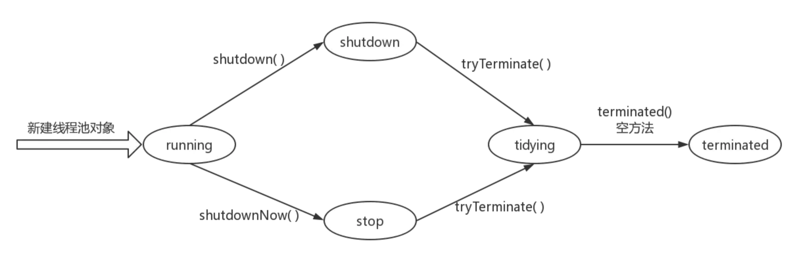

转载自[《线程池系列四》-ThreadPoolExecutor线程池源码分析](https://www.jianshu.com/p/a52f438c16be)

> 上一小节主要讲解了ThreadPoolExecutor的父类及其接口的源码分析。本节将开始ThreadPoolExecutor的源码分析，我们将从源码的角度分析线程池的实现原理。首先讲解和状态相关的成员变量和函数，接着讲解工作线程类Worker的实现，然后从构造函数、提交方法、线程池的两种关闭操作入手分析线程池的工作原理，最后讲解线程池的拒绝策略，以及使用线程池时应该注意的事项。本文内容较多，如果真的想掌握该内容，请耐心阅读。 

# 线程池状态 

  * 状态相关成员变量

ctl：该变量是最重要的一个变量，贯穿于整个线程池的实现逻辑。类型为AtomicInteger类型，是一个32位原子int型数字，在实现中，**其高三位用来表示线程池的状态，低29位用来表示线程池中线程个数，默认值为ctlOf(RUNNING, 0)，也就是状态为running，线程池个数为0**  
count_bits : 值为29， 即低count_bits位表示的数值就是线程池中线程的个数  
capacity：2^29-1 即29位能够表示的最大的数值，表示线程池中能包含线程个数的最大值 

线程池的状态使用ctl的高三位表示： 

| 状态       | 高三位值 | 含义                                                    |
| ---------- | -------- | ------------------------------------------------------- |
| running    | 100      | 运行状态，数值为负数                                    |
| shutdown   | 000      | 关闭状态，调用shutdown()方法                            |
| stop       | 001      | 关闭状态，调用shutdownNow()方法，与shutdown状态稍有不同 |
| tidying    | 010      | 线程池关闭的后处理状态                                  |
| terminated | 011      | 终止状态，这才是最终关闭                                |

<!--more-->

**从上图可以看出，线程池处于运行状态时，其ctl值为负数，并且状态从上往下，数值是依次变大的，可以比较数值的大小来判断线程的状态**

  * 状态转化图：



  * 与状态相关的方法  
此类方法，基本都是根据ctl与状态值比较大小而设定的方法，其中包括

| 函数                                       | 含义                                                    | 实现                                  |
| ------------------------------------------ | ------------------------------------------------------- | ------------------------------------- |
| runStateOf(int c)                          | 根据ctl获取当前状态，即只保留高三位的值，后29位全为0    | c & ~capacity                         |
| wokerCountOf(int c)                        | 根据ctl获取当前线程数，即低29位的值                     | c & capacity                          |
| ctlOf(int rs, int wc)                      | 根据当前状态和线程数，反推出ctl的值，高三位与低29位拼接 | rs 或操作 wc                          |
| runStateLessThan(int c, int s)             | 当前状态是否小于s状态                                   | c < s                                 |
| runStateAtLeast(int c, int s)              | 当前状态是否大于等于s状态                               | c >= s                                |
| isRunning(int c)                           | 是否为运行状态                                          | c < shutdown                          |
| compareAndIncrementWorkerCount(int expect) | CAS操作+1，操作不一定成功                               | ctl.compareAndSet(expect, expect + 1) |
| compareAndDecrementWorkerCount(int expect) | CAS操作-1，操作不一定成功                               | ctl.compareAndSet(expect, expect - 1) |
| decrementWorkerCount()                     | ctl的值-1，操作一定成功                                 | 在死循环中处理，直到-1操作成功        |
| advanceRunState(int targetState)           | 更新线程池状态，必须保证更新成功                        | 在死循环中处理                        |

上述的方法在线程池的实现中会经常的使用到，如果在看源码的过程中碰到了，可以到该表格进行查看 

# 线程池的成员变量 

| 类型                              | 变量名                 | 作用                                                         |
| --------------------------------- | ---------------------- | ------------------------------------------------------------ |
| BlockingQueue<Runnable>           | workQueue              | 阻塞队列，当线程数达到规定线程数的最大值且没有空闲线程执行任务时，任务会被添加该队列中 |
| ReentrantLock                     | mainLock               | 可重入锁，控制并发操作                                       |
| HashSet<Worker>                   | workers                | 存放线程对象，实现为HashSet，不是线程安全的，操作时加锁      |
| Condition                         | termination            | mainLock上的等待对象，用于阻塞和唤醒调用awaitTermination()方法的线程 |
| int                               | largestPoolSize        | 记录线程池已分配的最大线程数                                 |
| long                              | completedTaskCount     | 记录线程池完成的任务个数                                     |
| volatile ThreadFactory            | threadFactory          | 用于创建线程，可以设置线程名、线程组、优先级等属性           |
| volatile RejectedExecutionHandler | handler                | 拒绝策略                                                     |
| volatile long                     | keepAliveTime          | 允许最大空闲时间                                             |
| volatile boolean                  | allowCoreThreadTimeOut | 是否允许核心线程超时                                         |
| volatile int                      | corePoolSize           | 核心线程数                                                   |
| volatile int                      | maximumPoolSize        | 最大线程数                                                   |
| RejectedExecutionHandler          | defaultHandler         | 默认拒绝策略                                                 |

**注意volatile类型的变量，作用是为了保证各个线程间的可见性。对于没有volatile修饰的变量，在多线程环境下操作，必须加锁操作，进而保证线程间的可见性**。 

# 线程类-Worker 

Woker类具有两重身份  
（1） Runnable对象  
Worker内部封装了线程对象thread和任务firstTask，而自己本身又是线程对象thread的执行对象。thread每处理完一个任务之后，便会去阻塞队列中获取任务，如果没有任务就会等待，如果获取到任务就继续执行。  
（2）锁对象-非可重入互斥锁  
Worker类继承了AbstractQueuedSynchronizer类，说明Worker也具有锁的特性。同一个时刻，只能由一个线程操作。从其实现可以看出，该锁不支持重入。 

  * Worker类的成员变量

| 类型          | 变量名         | 作用                                            |
| ------------- | -------------- | ----------------------------------------------- |
| Thread        | thread         | 由threadFactory创建                             |
| Runnable      | firstTask      | 由线程池使用者提交（submit()或者execute()）任务 |
| volatile long | completedTasks | 该thread完成的任务数，用于统计                  |

  * 构造函数

在Worker对象构造完成之后，调用run()方法（此处的run指的是Worker的run(),该方法由线程池在添加Worker时启动线程对象thread时主动调用）之前，其Worker对象处于不可被获取状态（即锁的state位-1， 0表示可以被获取， 1表示锁被占用），同时也禁止中断（加锁的地方禁止响应中断，只有在state为0时才会响应中断），其构造方法如下： 
    
    Worker(Runnable firstTask) {
        setState(-1); // inhibit interrupts until runWorker
        this.firstTask = firstTask;
       //this作为Runnable对象参数传给线程类，那么线程类执行时，执行的就是Worker的run()方法
        this.thread = getThreadFactory().newThread(this);
    }


设置锁的状态为-1，并对任务和线程赋值。 

  * run()方法

该方法只是简单调用了runWorker(this);而runWorker()方法将是本节的讨论的重点方法。请耐心继续往下看。 

  * 与锁相关的方法

方法作用

| 方法              | 作用                                                         |
| ----------------- | ------------------------------------------------------------ |
| isHeldExclusively | 锁是否已被占有                                               |
| tryAcquire        | 在调用lock()方法的时候会间接调用该方法，如果状态为0，则可以获取，否则阻塞等待 |
| tryRelease        | unlock()时间接调用该方法，由于是互斥锁，只会有一个线程调用，修改状态信息无需使用CAS，不会产生竞争 |

上述三个方法是实现AbstractQueuedSynchronizer重写的方法，不提供给外界直接调用，外界应该调用如下方法： 

| 方法     | 作用                                                         |
| -------- | ------------------------------------------------------------ |
| lock     | 获取锁，阻塞方法，当获取锁时才会返回。调用acquire()方法，此处其参数1没有用。间接调用tryAcquire方法 |
| tryLock  | 获取锁，非阻塞方法，不管是否获取锁，都直接返回               |
| unLock   | 释放锁，调用release()方法，间接调用tryRelease()方法，因为只会有一个线程获取锁，所以释放时不存在竞争关系 |
| isLocked | 判断锁是否被占用，调用isHeldExclusively()方法                |

上述方法类外部可以直接调用。 

  * interruptIfStarted()方法

该方法在调用shutdownNow()方法时被调用，用于终止线程。其源码如下： 
```
void interruptIfStarted() {
    Thread t;
    if (getState() >= 0 && (t = thread) != null && !t.isInterrupted()) {
    try {
        t.interrupt();
    } catch (SecurityException ignore) {
    }
    }
}
```

当线程在执行任务时，且线程不为null，线程没有被中断，则中断线程，但是该中断不会立即响应，因为work定义的锁为不响应中断的锁，当任务执行完成释放锁之后才会响应该中断。 

**总结：Worker在构造函数中，通过getThreadFactory().newThread(this)创建线程;this就是Worker对象，一个Runnable对象。换句话说，执行该线程的start()方法，执行的就是Worker类的run()方法。其次，Worker作为锁的角色有两个作用：一是在执行任务时，通过加锁lock()来屏蔽到中断操作，只有在unlock()后,也就是获取任务getTask()方法里，才会响应中断。第二个作用是，在线程池调用tryLock()试图中断线程时，只要有任务执行，tryLock()就会返回false，通过tryLock()操作可以判断线程是否空闲。**

# 线程池构造方法 

线程池的构造都间接调用该构造方法，需要合理的设置参数，这个内容在之前的文章中已经讲过了，此处不再讲解。 
```java
public ThreadPoolExecutor(int corePoolSize,
                          int maximumPoolSize,
                          long keepAliveTime,
                          TimeUnit unit,
                          BlockingQueue<Runnable> workQueue,
                          ThreadFactory threadFactory,
                          RejectedExecutionHandler handler) {
    if (corePoolSize < 0 ||
            maximumPoolSize <= 0 ||
            maximumPoolSize < corePoolSize ||
            keepAliveTime < 0)
        throw new IllegalArgumentException();
    if (workQueue == null || threadFactory == null || handler == null)
        throw new NullPointerException();
    this.acc = System.getSecurityManager() == null ?
            null :
            AccessController.getContext();
    this.corePoolSize = corePoolSize;
    this.maximumPoolSize = maximumPoolSize;
    this.workQueue = workQueue;
    this.keepAliveTime = unit.toNanos(keepAliveTime);
    this.threadFactory = threadFactory;
    this.handler = handler;
}
```

# execute(Runnable command)方法 

  * 处理逻辑
  1. 如果当前线程个数 < corePoolSize, 则新增一个线程(addWorker(command, true))执行该任务，成功则返回
  2. 如果添加失败，并且为运行状态，说明线程个数已经>=corePoolSize，则执行第4步
  3. 如果添加失败，并且为非运行状态，则执行拒绝策略
  4. 如果是运行状态，且当前线程数>=corePoolSize，则将任务添加到阻塞队列
  5. 如果第4步添加阻塞队列失败，说明阻塞队列满，并且当前线程数<maximumPoolSize,则新增一个线程执行该任务
  6. 如果第5步中新增线程失败（这里包括2,3两种情况（2的话就是>=maximumPoolSize）），则执行拒绝策略

更加详细的实现，请参照源码注释理解，源码如下： 
```java
public void execute(Runnable command) {
    if (command == null)
        throw new NullPointerException();

    int c = ctl.get();
    //如果当前线程数<核心线程数
    if (workerCountOf(c) < corePoolSize) {
        if (addWorker(command, true))
            return;
        c = ctl.get();
    }
    //代码执行到这，存在两种情况
    //1. 当前线程数>=核心线程数
    //2. 当前线程数<核心线程数，但是添加Worker失败，失败又有如下情况
    //2.1 线程池的状态为stop，tidying，terminated
    //2.2 shutdown command不为null
    //2.3 shutdown command为null， 阻塞队列也为空（这种情况不会出现在这里）

    //如果是运行状态，说明属于1这种情况，那么将任务添加到阻塞队列，此处使用offer()非阻塞方法
    if (isRunning(c) && workQueue.offer(command)) {
        //即便添加成功了，重新验证一下状态，如果状态为非运行状态，则一处该任务，执行决绝策略
        int recheck = ctl.get();
        if (! isRunning(recheck) && remove(command))
            reject(command);
        //如果是运行状态，保证工作线程存在
        else if (workerCountOf(recheck) == 0)
            addWorker(null, false);
    }
    //代码运行到这里，存在两种情况
    //1. 不是运行状态 也就是上面的2的情况（添加worker失败的），再次调用仍然会失败
    //2. 添加到阻塞队列失败的，说明阻塞队列满
    else if (!addWorker(command, false))
        //1这种情况，肯定会执行拒绝策略
        //2这种情况，如果已达到线程数上限，同样会执行拒绝策略
        reject(command);
}
```

总结：**当线程状态不为运行状态时（不管是shutdown还是stop）：都会执行拒绝策略（这不是绝对的，shutdown状态下，还是可以添加工作线程的（条件为shutdown状态下 command==null 且 阻塞队列非空，在该方法中不会出现该条件，因为command做了非空判断，这里只讨论分支逻辑，不要考虑addWorker(null, false));这条语句），但是stop状态却不可以）。换句话说：执行shutdown()或者shutdownNow()后，不能够再提交新任务**

# addWorker(Runnable firstTask, boolean core)方法 

在execute()方法中，多次调用了addWorker()方法，addWorker()方法决定了添加一个工作线程的条件，如果符合添加一个线程的条件，那么该方法会先保证将ctl的值加1，然后保证添加一个工作线程，并启动该线程。 

源码如下： 
```java
private boolean addWorker(Runnable firstTask, boolean core) {
    //在死循环中不断判断条件是否满足添加一个工作线程
    //如果不满足条件啊，直接返回false
    //如果满足条件，则ctl值+1
    retry:
    for (;;) {
        int c = ctl.get();
        int rs = runStateOf(c);

        // 不满足条件的三种情况
        // 1. 运行状态为 stop, tidying, terminated
        // 2. 运行状态为 shutdown 且 任务不为空
        // 3. 运行状态为 shutdown 任务为空 且 任务线程为空（没事可做，为什么要增加线程）
        if (rs >= SHUTDOWN &&
                ! (rs == SHUTDOWN &&
                        firstTask == null &&
                        ! workQueue.isEmpty()))
            return false;
        //代码运行到这，存在两种情况
        // 1. 运行状态为running
        // 2. 运行状态为shutdown， 任务为null，阻塞队列不为空
        for (;;) {
            int wc = workerCountOf(c);
            //如果线程数已经达到上限，则返回false
            if (wc >= CAPACITY ||
                    wc >= (core ? corePoolSize : maximumPoolSize))
                return false;
            //线程数ctl值+1， 设置失败说明线程池环境发生了变化，需要重试
            if (compareAndIncrementWorkerCount(c))
                break retry;
            c = ctl.get();  // Re-read ctl
            if (runStateOf(c) != rs)
                continue retry;
            // else CAS failed due to workerCount change; retry inner loop
        }
    }

    //代码执行到这里，说明线程数已经成功+1， 现在要添加一个worker，并执行
    //标记worker是否已经启动
    boolean workerStarted = false;
    //标记worker是否已经添加
    boolean workerAdded = false;
    Worker w = null;
    try {
       //新建worker对象
        w = new Worker(firstTask);
        final Thread t = w.thread;
        if (t != null) {
            //这里需要获取全局锁，因为存放worker的对象workers的实现是HashSet类型的，线程不安全，使用时需要加锁
            final ReentrantLock mainLock = this.mainLock;
            mainLock.lock();
            try {
                int rs = runStateOf(ctl.get());
                //再次判断线程池装填
                //1. 运行时状
                //2. shutdown 且 任务为空，才能执行添加操作
                if (rs < SHUTDOWN ||
                        (rs == SHUTDOWN && firstTask == null)) {
                    //如果线程已经执行了，那么抛出异常，因为我们还没有执行start()
                    if (t.isAlive()) // precheck that t is startable
                        throw new IllegalThreadStateException();
                    //所有的事情都为了这一句，添加工作线程
                    workers.add(w);
                    int s = workers.size();
                    if (s > largestPoolSize)
                        largestPoolSize = s;
                    workerAdded = true;
                }
            } finally {
                mainLock.unlock();
            }
            //如果添加成功则启动该线程，线程启动后会执行runWorker()方法
            if (workerAdded) {
                t.start();
                workerStarted = true;
            }
        }
    } finally {
        //如果没有启动成功，则应该移除该worker
        if (! workerStarted)
            //该方法中存在ctl值-1的操作，保证计数和线程数一致
            addWorkerFailed(w);
    }
    return workerStarted;
}
```

# addWorkerFailed(Worker w)方法 

当添加工作线程失败时（并不是addWorker()方法返回false，而是workerStarted这个boolean值为false），需要删除该worker，并且使ctl的值-1 
```java
private void addWorkerFailed(Worker w) {
    //需要操作workers，类型为线程不安全的HashSet，所以需要加锁
    final ReentrantLock mainLock = this.mainLock;
    mainLock.lock();
    try {
        if (w != null)
            workers.remove(w);
        //执行-1操作，保证-1成功
        decrementWorkerCount();
        //该方法的作用就是终止掉一个线程，让线程能够跳出runWorker()方法的循环，而正常执行完
        //shudown(),shutdownNow()方法都会调用该方法，很重要
        tryTerminate();
    } finally {
        mainLock.unlock();
    }
}
```

# runWorker(Worker w)方法 

当一个线程启动之后，会执行该方法。该方法将任务的处理逻辑加锁，保证不被中断。通过从阻塞队列获取任务不断执行任务，当获取的任务为null时，该线程退出，需要执行线程退出后的后处理逻辑。 
```java
final void runWorker(Worker w) {
    //当前线程即为worker中包含的线程对象
    Thread wt = Thread.currentThread();
    Runnable task = w.firstTask;
    w.firstTask = null;
   //将worker的锁状态置为0，这样锁可以被获取
    w.unlock(); 
    //用来表示线程是否为正常退出，true：非正常退出，false：正常退出
    boolean completedAbruptly = true;
    try {
        //不断的从阻塞队列中获取任务（getTask()）， 如果阻塞队里为空，getTask()会阻塞
        //getTask方法内有超时判断，如果工作线程多了，同样会通过超时返回null，让该线程执行完毕并退出
        //遇到中断，getTask()会返回null
        //getTask（）返回值为null，会正常停止该工作线程
        while (task != null || (task = getTask()) != null) {
            //加锁，其他线程不能获取该锁（主要是调用shutdown()方法时会执行tryLock()方法）
            //加锁的作用，还可以屏蔽中断，在加锁和解锁之间是不响应中断的
            w.lock();
            //如果状态为stop， tidying， terminated，则中断
            //如果为running，shutdown状态，且存在中断的话，清空中断标记
            //Thread.interrupted（）方法会清除中断标记
            if ((runStateAtLeast(ctl.get(), STOP) ||
                    (Thread.interrupted() &&
                            runStateAtLeast(ctl.get(), STOP))) &&
                    !wt.isInterrupted())
                //该中断会在getTask()里体现
                wt.interrupt();
            try {
                //任务执行前的执行操作，空方法
                beforeExecute(wt, task);
                Throwable thrown = null;
                try {
                    task.run();
                } catch (RuntimeException x) {
                    thrown = x; throw x;
                } catch (Error x) {
                    thrown = x; throw x;
                } catch (Throwable x) {
                    thrown = x; throw new Error(x);
                } finally {
                     //任务执行完成后执行操作，空方法
                    afterExecute(task, thrown);
                }
            } finally {
                task = null;
                w.completedTasks++;
                w.unlock();
            }
        }
        //代码走到这代表是根据getTask()返回值为null退出的循环
        completedAbruptly = false;
    } finally {
        //线程退出，执行后处理操作，从workers中删除worker，ctl值-1
        processWorkerExit(w, completedAbruptly);
    }
}
```

**总结：从上述源码中可以看出，shutdown状态不会中断线程，stop状态会中断线程，说明：shutdown状态时，还会继续执行阻塞队列中的任务，stop状态时，不会执行阻塞队列中的任务，这是两个状态的最主要的区别.**

# processWorkerExit(Worker w, boolean completedAbruptly)方法 

该方法主要处理已存在的线程终止的后处理操作，分为正常中断和非正常中断两种。对于非正常中断的线程，需要通过新增工作线程的方法将线程补回来，对于正常中断的线程，需要保证在阻塞队列非空的情况有工作线程存在。 
```java
private void processWorkerExit(Worker w, boolean completedAbruptly) {
    //如果是非正常啊中断，那么先将ctl值-1
    if (completedAbruptly)
        decrementWorkerCount();

    //获取全局锁，从workers中删除worker，删除前将该worker的执行完成的任务数汇总到completedTaskCount
    final ReentrantLock mainLock = this.mainLock;
    mainLock.lock();
    try {
        completedTaskCount += w.completedTasks;
        workers.remove(w);
    } finally {
        mainLock.unlock();
    }
    //只要减少worker的地方都会执行该方法，主要是传播停止信号
    tryTerminate();

    int c = ctl.get();
    //如果状态为running， shutdown
    if (runStateLessThan(c, STOP)) {
         //正常终止，那么判断线程池中是否还有工作线程，如果没有工作线程了，那么新增工作线程
        if (!completedAbruptly) {
            int min = allowCoreThreadTimeOut ? 0 : corePoolSize;
            if (min == 0 && ! workQueue.isEmpty())
                min = 1;
            if (workerCountOf(c) >= min)
                return; // replacement not needed
        }
        //异常终止导致少了一个线程，应该将该线程补回来
        addWorker(null, false);
    }
}
```

**总结：该方法只在线程意外终止时，ctl值-1，那么线程正常终止就不-1了吗？这个问题找了好久，其实在runWorker()方法中的getTask()方法，当该方法返回null时，代表着该线程正常终止，其中附加了ctl-1的操作，所以正常终止的线程的ctl-1的操作是在getTask()方法中执行的**

# getTask()方法 

该方法的作用就是从阻塞队列中获取任务，如果获取不到任务就会阻塞，keepAliveTime的作用就在该方法中体现。阻塞又分为两种 有限阻塞poll()和完全阻塞take()，但是这两个方法都会响应中断，(**中断的作用也是从这里体现出来的，只有当线程池的状态为stop， tidying，terminated，shutdown并且阻塞队列为空时，该中断才有效**)，响应中断后，会重新执行getTask()方法的逻辑。**并不是响应中断就会返回null，有可能线程池状态为running，执行runWorker()方法时，在执行getTask()方法时就来了中断（该中断信号并没有被runWork()方法的逻辑清除掉），那么尽管getTask()处理逻辑重试，还是不会返回null，做了双重保证。**
```java
private Runnable getTask() {
    //标记是否超时
    boolean timedOut = false;

    for (;;) {
        int c = ctl.get();
        int rs = runStateOf(c);

        //返回空的条件，存在两种
        //1. 状态为stop， tidying， terminated
        //2. 状态为shutdown 且 队列为空
        if (rs >= SHUTDOWN && (rs >= STOP || workQueue.isEmpty())) {
            //ctl的值-1，这个操作一定要重视，经常找不到他
            decrementWorkerCount();
            return null;
        }
         //代码执行到这，存在两种情况
         //1. running
         //2. shutdown 阻塞队列非空
        int wc = workerCountOf(c);

        //判断是否处理超时
        boolean timed = allowCoreThreadTimeOut || wc > corePoolSize;
        //如果需要减少工作线程（线程数>maxinumPoolSize,或者处理超时并超时两种情况）
        //并且存在可以减少的线程数，那么就减少线程数，返回null，结束一个线程
        if ((wc > maximumPoolSize || (timed && timedOut))
                && (wc > 1 || workQueue.isEmpty())) {
            if (compareAndDecrementWorkerCount(c))
                return null;
            continue;
        }

        try {
            //如果设置超时，那么就使用非阻塞的方法poll()，否则使用阻塞方法take()
            Runnable r = timed ?
                    workQueue.poll(keepAliveTime, TimeUnit.NANOSECONDS) :
                    workQueue.take();
            if (r != null)
                return r;
            //如果超时了，为什么不能直接返回null，因为要确保wc > 1 || workQueue.isEmpty()
            //所以又循环了一次
            timedOut = true;
        } catch (InterruptedException retry) {
            //响应中断，重试
            timedOut = false;
        }
    }
}
```

# tryTerminate()方法 

该方法是关闭线程池的关键，涉及到了三种状态的改变  
具体细节请查看源码注释，源码如下： 
```java
final void tryTerminate() {
    //这是一个死循环，看到这种情况，就需要注意返回值
    for (;;) {
        int c = ctl.get();
        //直接返回的情况，有3种情况
        // 1. 如果是运行状态，直接返回
        // 2. 如果运行状态为tidying， terminated（这两种状态时，说明已经没有工作线程了）
        // 3. 如果是shutdown并且阻塞队列非空，直接返回
        if (isRunning(c) ||
                runStateAtLeast(c, TIDYING) ||
                (runStateOf(c) == SHUTDOWN && ! workQueue.isEmpty()))
            return;
        //代码执行到这里时，只有两种情况
        // 1. stop状态
        // 2. shutdown状态，且阻塞队列为空
        // 如果工作线程不为0，则中断一个线程
        if (workerCountOf(c) != 0) { 
            //中断一个空闲线程
            interruptIdleWorkers(ONLY_ONE);
            return;
        }

        //代码执行到这，说明工作线程数为0,此处可能存在两种状态变化
        //1. shutdown-->tidying
        //2. stop--->tidying
        //3. tidying-->terminated 执行线程池关闭的后处理操作，terminated()空方法
        final ReentrantLock mainLock = this.mainLock;
        mainLock.lock();
        try {
            if (ctl.compareAndSet(c, ctlOf(TIDYING, 0))) {
                try {
                    terminated();
                } finally {
                    ctl.set(ctlOf(TERMINATED, 0));
                    //唤醒等待线程池关闭的线程（调用awaitTermination()方法的线程）
                    termination.signalAll();
                }
                return;
            }
        } finally {
            mainLock.unlock();
        }
        // else retry on failed CAS
    }
}
```

**总结：这里必须要明白为什么是中断1个空闲线程。这是因为中断1个空闲线程，就会执行processWorkerExit(),而该方法内部又调用了tryTerminate()方法，该方法在满足关闭线程池的条件时会进而中断一个空闲线程，调用processWorkerExit()方法。因此只要条件满足，所有的线程都会被中断。因此该方法具有扩散中断线程的作用。**

# interruptIdleWorkers(boolean onlyOne)方法 

如果参数为true，则只中断一个空闲线程，tryTerminate()方法中只传入true  
如果参数为false，则中断所有的空闲线程 
```java
private void interruptIdleWorkers(boolean onlyOne) {
    //获取全局锁，因为需要便利HashSet，保证不能让其他的线程修改HashSet的值
    final ReentrantLock mainLock = this.mainLock;
    mainLock.lock();
    try {
        for (Worker w : workers) {
            Thread t = w.thread;
            //tryLock()方法判断该锁有误被占用，占用说明在执行任务，返回false
            //未占用，表示空闲，返回true
            if (!t.isInterrupted() && w.tryLock()) {
                try {
                    t.interrupt();
                } catch (SecurityException ignore) {
                } finally {
                    w.unlock();
                }
            }
            //如果参数为true，则只中断一个
            if (onlyOne)
                break;
        }
    } finally {
        mainLock.unlock();
    }
}
```

# shutdown()方法 

该方法用于关闭线程池，将状态修改为shutdown，存在以下几点性质： 

  1. 不能提交新任务， 从excute()方法中可以看出
  2. 可以继续执行完阻塞队列中的任务，从runWoker()方法中可以看出
  3. 终止所有的空闲线程
  4. 返回值为void
```java
public void shutdown() {
    final ReentrantLock mainLock = this.mainLock;
    mainLock.lock();
    try {
        checkShutdownAccess();
        //更新线程池状态
        advanceRunState(SHUTDOWN);
        //中断所有空闲线程，调用interruptIdleWorkers(false)
        interruptIdleWorkers();
        //空方法，ScheduledThreadPoolExecutor使用
        onShutdown();
    } finally {
        mainLock.unlock();
    }
    //又关闭线程的地方就有该方法
    tryTerminate();
}
```

# shutdownNow()方法 

该方法用于关闭线程池，将状态修改为stop状态，存在以下几点性质： 

  1. 不能提交新任务，从 execute()方法可以看出
  2. 线程直接中断，不在执行任务，阻塞队列的任务不在执行，从runWorker()和interruptWorkers()方法可以看出
  3. 终止所有的线程 **不管线程是否工作，都终止，任务的执行是原子性的，不会出现执行一半任务的情况**
  4. 返回值为阻塞队列中的任务列表
```java
public List<Runnable> shutdownNow() {
    List<Runnable> tasks;
    final ReentrantLock mainLock = this.mainLock;
    mainLock.lock();
    try {
        checkShutdownAccess();
        //修改为stop状态
        advanceRunState(STOP);
        //终止所有线程，调用Worker的interruptIfStarted()方法
        interruptWorkers();
        //获取阻塞队列中的任务列表
        tasks = drainQueue();
    } finally {
        mainLock.unlock();
    }
    //该方法必须调用，上面虽然是终止所有，但是并不定全部都能中断掉，因为中断是有条件的
    tryTerminate();
    //返回阻塞队列中的任务列表
    return tasks;
}
```

# drainQueue()方法 

使用阻塞队列的drainTo()方法，获取所有的任务，将任务添加到list中，并返回 
```java
private List<Runnable> drainQueue() {
    BlockingQueue<Runnable> q = workQueue;
    ArrayList<Runnable> taskList = new ArrayList<Runnable>();
    //将任务添加到list中，采用该方式效率高
    q.drainTo(taskList);
    //如果队列中还存在元素，则一个个添加到list中
    if (!q.isEmpty()) {
        for (Runnable r : q.toArray(new Runnable[0])) {
            if (q.remove(r))
                taskList.add(r);
        }
    }
    return taskList;
}
```

# awaitTermination(long timeout, TimeUnit unit)方法 

最长等待timeout时间，等待线程池完全关闭，该方法没有新的东西，就是判断线程池的状态是否为terminated状态，如果是则返回，如果不是，则等待timeout时间并添加到全局锁的Conditon等待队列中，如果超时返回false。 
```java
public boolean awaitTermination(long timeout, TimeUnit unit)
        throws InterruptedException {
    long nanos = unit.toNanos(timeout);
    final ReentrantLock mainLock = this.mainLock;
    mainLock.lock();
    try {
        for (;;) {
            if (runStateAtLeast(ctl.get(), TERMINATED))
                return true;
            if (nanos <= 0)
                return false;
            nanos = termination.awaitNanos(nanos);
        }
    } finally {
        mainLock.unlock();
    }
}
```

# 线程池的拒绝策略 

从上面的源码讲解中，已经知道了线程池在什么情况下会调用拒绝策略，合理的设置拒绝策略在项目的应用中是十分重要的。线程池提供了四种拒绝策略，我们也可以根据实际的业务需求定义自己的拒绝策略，只需实现RejectedExecutionHandler接口，在定义线程池时，传入我们自己定义的拒绝策略对象即可。 

  * CallerRunsPolicy  
从名字就可以看出，该策略的意思就是调用者运行该任务。那么调用者是谁？那就是提交任务的线程。

**好处**：就是线程池负载过重（或者是自己设置的参数有问题），调用者运行任务可以延缓提交任务的速度，任务不会丢失。  
**坏处**：加大主线程的处理时间  
源码如下： 
```java
public void rejectedExecution(Runnable r, ThreadPoolExecutor e) {
    if (!e.isShutdown()) {
        r.run();
    }
}
```

  * AbortPolicy  
该策略是**线程池默认的拒绝策略**，直接抛出异常，该异常时运行时异常，如果是线上服务，一直抛异常怕是不好。  
其源码如下：
```java
public void rejectedExecution(Runnable r, ThreadPoolExecutor e) {
    throw new RejectedExecutionException("Task " + r.toString() +
            " rejected from " +
            e.toString());
}
```
  * DiscardPolicy  
该策略就是什么都不做，假装什么事情都没有发生过，缺点也很明显，**会丢任务**，对于不能丢任务的场景是不能用的，方法实现是空实现，这里不贴代码了。
  * DiscardOldestPolicy  
该策略会将最老的任务移除（阻塞队列的对头元素），重新提交任务。缺点就是**任务还是会丢失，而且任务不一定能加入到阻塞队列（如果此时，其他线程也提交任务）**  
源码实现如下：
```java
public void rejectedExecution(Runnable r, ThreadPoolExecutor e) {
    if (!e.isShutdown()) {
        e.getQueue().poll();
        e.execute(r);
    }
}
```

# 总结 

使用线程池时，一般我们不会放任线程池中的线程和阻塞队列占用的资源无限制的使用，因此一般会设定好线程数，设置固定大小的阻塞队列，由于阻塞队列和线程的资源都分配了固定的，就必须考虑任务的拒绝策略，至于使用什么拒绝策略，根据自己的业务需求选择或者自定义拒绝策略。对于线程数量的把握，一定要经过压测之后确定，具体业务情景具体分析。  
此外，还要做好线程池的隔离，不要让一个线程池做所有的事情，避免一个功能模块出现问题影响到其他的功能。还应该做好降级应对线程池崩溃的情况，如果线程池崩溃，使用其他的处理逻辑取代，保证线上服务稳定可用。 

